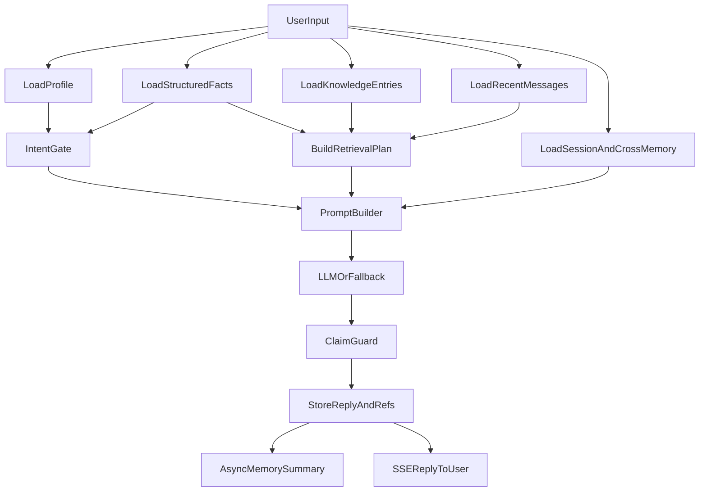
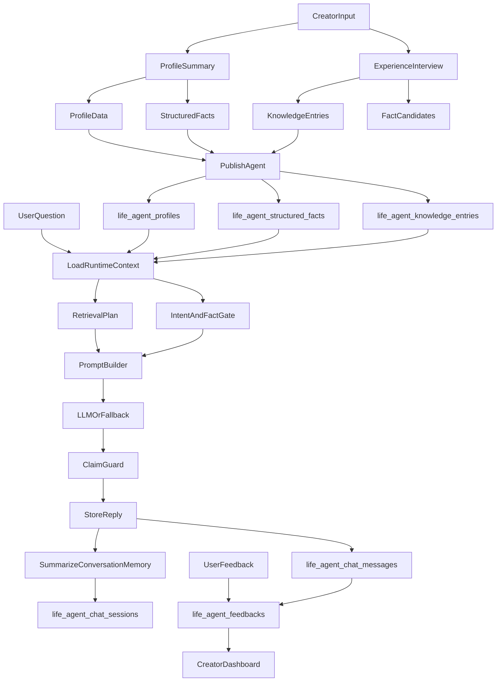
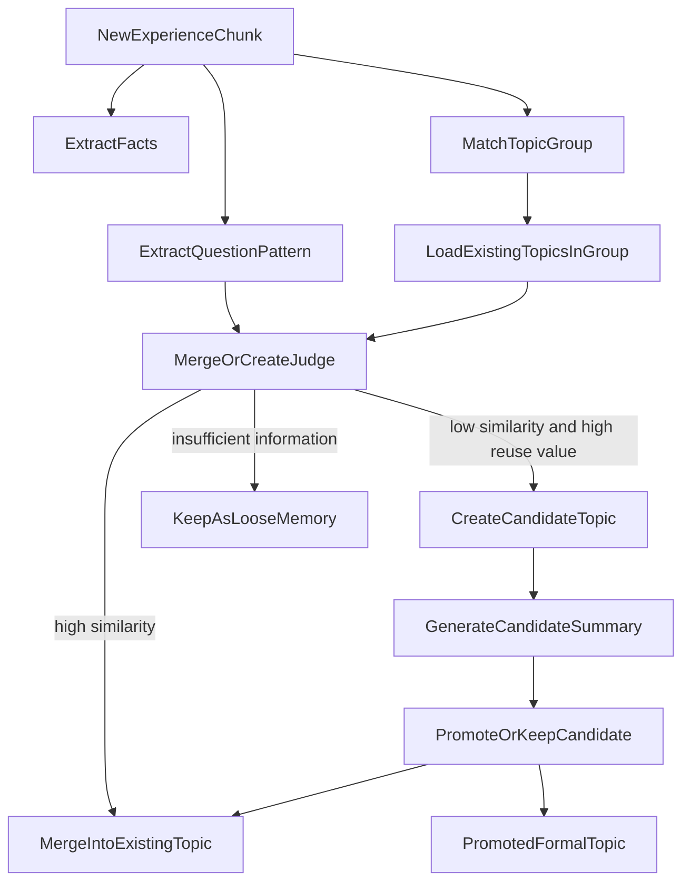

# Life Agent 人格与记忆全流程说明

本文档描述当前仓库中 Life Agent 的人格、经验、记忆、回答生成、存储与反馈闭环的完整流程，重点回答以下问题：

- 用户输入的“基础资料”和“经验对话”如何进入系统
- 系统内部如何拆分为人格、结构化事实、知识条目、会话记忆
- 聊天时如何检索、组装上下文、生成回答并做约束
- 回答后如何存储、如何形成后续记忆
- 用户和创建者最终能看到什么反馈与数据

## 1. 总体目标

当前 Life Agent 的实现目标不是“训练一个新的模型参数”，而是构建一套以**人格配置 + 结构化事实 + 知识条目 + 分层记忆 + 反馈闭环**为核心的运行时系统。

系统希望实现：

- 回答尽量像创建者本人
- 优先基于明确事实和真实经历
- 低置信时保留表达，而不是硬编
- 高风险事实不胡说
- 通过反馈和记忆机制持续提升稳定性

## 2. 核心数据层

### 2.1 人格层

人格信息主要来自 `life_agent_profiles`，对应后端模型：

- `display_name`
- `headline`
- `short_bio`
- `audience`
- `welcome_message`
- `persona_archetype`
- `tone_style`
- `response_style`
- `mbti`
- `forbidden_phrases`
- `example_replies`
- `not_suitable_for`

这部分定义了 Agent 的“像谁说话”。

### 2.2 结构化事实层

结构化事实存放在 `life_agent_structured_facts`，对应模型 `LifeAgentStructuredFact`。

这层保存最关键、最容易幻觉的事实，例如：

- 名字
- 学校
- 学历
- 工作
- 城市
- 收入
- 比赛名 / 事件名

每条结构化事实带有：

- `fact_key`
- `fact_value`
- `fact_type`
- `source`
- `confidence`
- `status`
- `evidence`
- `last_confirmed_at`

这层的目标是：让事实问题尽量走“确定答案”，而不是让 LLM 自由发挥。

### 2.3 知识条目层

知识条目存放在 `life_agent_knowledge_entries`，对应模型 `LifeAgentKnowledgeEntry`。

知识条目更偏“可讲给别人听的经历和经验素材”，常见字段：

- `category`
- `title`
- `content`
- `tags`

这层的目标是：给 Agent 提供“基于亲身经历说话”的材料，而不是只回答冷冰冰的事实。

### 2.4 会话记忆层

会话记忆存放在 `life_agent_chat_sessions` 中的两个字段：

- `summary`
- `memory_json`

其中 `memory_json` 现在会被组织成结构化记忆，包含：

- `summaryText`
- `userStatedFacts`
- `userPreferences`
- `conversationTopics`
- `assistantSuggestions`

这层的目标是：压缩长对话，但避免把自由摘要直接当作永久事实。

### 2.5 反馈层

反馈存放在 `life_agent_feedbacks`，用于记录用户对单条回答的评价。

目前支持的反馈类型：

- `helpful`
- `not_specific`
- `not_suitable`
- `factual_error`
- `contradiction`
- `too_confident`

并且会额外保存：

- `assistant_excerpt`
- `user_question`
- `comment`
- `source_refs`

`source_refs` 用于追踪这次错误回答当时引用了哪些事实或知识来源。

## 3. 创建期流程

创建期分成三块：

- 基础资料整理
- 经验补充与追问
- 最终发布入库

### 3.1 基础资料输入

前端页面：

- `src/app/life-agents/create/page.tsx`

用户先输入：

- Agent 名称
- 一句话介绍
- 短简介
- 学校 / 学历 / 工作 / 收入
- 受众
- 欢迎语
- 擅长标签
- 示例问题
- 人格风格

其中一部分是逐步对话式输入，一部分是表单式输入。

### 3.2 基础资料整理为 profile 和 facts

前端请求：

- `POST /api/life-agents/create/profile-summary`

后端入口：

- `backend/internal/handler/life_agents.go`

LLM 整理逻辑：

- `backend/internal/lifeagent/profile_summary.go`

系统会从用户输入中产出三类结果：

- `profile`
- `knowledgeEntries`
- `structuredFacts`

也就是说，基础资料不会只变成一段描述，而会被拆成：

- 影响人格和展示的信息
- 可供后续回答的知识条目
- 更稳定的结构化事实

### 3.3 经验追问

前端请求：

- `POST /api/life-agents/create/next-question`

后端逻辑：

- `backend/internal/lifeagent/create_questions.go`

这一步系统会根据用户已输入的经验：

- 生成下一个问题
- 提取语气风格
- 补充 `knowledgeAdd`
- 补充 `factCandidates`

其中：

- `knowledgeAdd` 更偏经验型内容
- `factCandidates` 更偏事实候选

这样长经验输入不会只得到一段摘要，而会逐轮积累成不同层次的资产。

### 3.4 发布入库

最终发布请求：

- `POST /api/life-agents`

后端会：

1. 创建 `LifeAgentProfile`
2. 写入所有 `LifeAgentKnowledgeEntry`
3. 调用 `refreshLifeAgentStructuredFacts(profileID)` 重新生成结构化事实

所以最终系统内部是按“资料层 + 知识层 + 事实层”保存，而不是只存一份总总结。

## 4. 运行期回答流程

用户真正开始咨询时，系统会进入“检索 + 组装 + 生成 + 校验 + 存储”的主链路。

### 4.1 运行期总体图



### 4.2 读取上下文

聊天入口：

- `POST /api/life-agents/:id/chat`

对应逻辑：

- `backend/internal/handler/life_agents.go`

系统会读取：

- 当前 Agent 的 profile
- 当前 Agent 的结构化事实
- 当前 Agent 的知识条目
- 最近 20 条会话消息
- 当前会话摘要
- 该用户与该 Agent 之前最多 3 个会话的记忆摘要

### 4.3 特殊问题短路

如果用户问的是身份类问题，例如：

- 你叫什么
- 你是谁
- 怎么称呼你

系统会先走规则判断：

- `ClassifyQuestionIntent`
- `IsIdentityQuestion`
- `BuildIdentityReply`

这类问题优先不交给 LLM，直接用 profile 回答，以降低身份幻觉。

另外，结构化事实问答也会优先尝试短路：

- `ResolveGroundedFactReply`

比如问学校、学历、工作、城市、比赛名时，系统先查结构化事实。

如果有高置信事实，直接回答。
如果是高风险隐私问题但没有依据，直接保守拒答。

### 4.4 构造检索计划

如果不是可以直接短路的事实问题，系统会构造一个检索计划：

- `BuildRetrievalPlan`

该计划会同时考虑：

- `facts`
- `entries`
- 最近几轮对话
- 当前消息

最终产出：

- 命中的结构化事实
- 命中的知识条目
- 当前检索置信度
- 命中原因

这里的关键点是：

- 不再“无命中也强塞前几条”
- 改为根据分值决定高、中、低置信

### 4.5 构造 Prompt

Prompt 的主构造逻辑在：

- `backend/internal/lifeagent/llm.go`

系统会把上下文拆成几个块：

- 人格和风格约束
- 事实边界
- 结构化事实
- 检索到的知识条目
- 当前检索置信度
- 会话摘要
- 跨会话记忆

当前 Prompt 的关键原则：

- 结构化事实优先级最高
- 没依据不能编造成确定事实
- 低置信时优先保留表达
- 高风险事实不能乱猜
- 回答要像真人分享经历

### 4.6 调用 LLM 或回退回复

主入口：

- `BuildReplyWithLLM`
- `BuildReplyWithLLMStream`

如果 LLM 可用：

- 正常调用模型

如果 LLM 不可用或失败：

- 回退到 `BuildReply`

回退路径依然会使用：

- 结构化事实
- 知识条目
- 高风险规则

所以即使模型失败，也不是完全失控的。

### 4.7 输出后校验

LLM 输出后，系统不会原样直接放出，还会经过：

- `ApplyClaimGuard`

这个阶段主要做：

- 如果是低置信事实问题，避免把话说死
- 如果回答和已有结构化事实明显不一致，优先改回事实答案
- 把明显不该说得太满的内容降级成保留表达

这一步是当前“降低自相矛盾”的关键保险层。

## 5. 会话记忆如何形成

### 5.1 当前会话内

系统会保留：

- 最近 20 条原始消息
- 当前会话的 `summary`
- 当前会话的 `memory_json`

### 5.2 超过一定长度后异步摘要

当消息数超过阈值后，系统会异步调用：

- `SummarizeConversationMemory`

该过程会把原始消息总结成结构化记忆：

- `summaryText`
- `userStatedFacts`
- `userPreferences`
- `conversationTopics`
- `assistantSuggestions`

然后写回：

- `life_agent_chat_sessions.summary`
- `life_agent_chat_sessions.memory_json`
- `life_agent_chat_sessions.memory_review_status`

### 5.3 跨会话记忆

后续再问时，系统会读取之前若干会话的 `memory_json`，通过：

- `BuildCrossSessionMemory`

只拼接相对安全的部分：

- 话题
- 偏好
- 已确认事实

而不是把整个旧摘要原样塞进来。

这一步的作用是：

- 让 Agent 对同一用户保持连续感
- 但尽量减少“摘要污染事实”

## 6. 存储层最终保存什么

### 6.1 用户创建之后

会保存：

- `LifeAgentProfile`
- `LifeAgentKnowledgeEntry[]`
- `LifeAgentStructuredFact[]`

### 6.2 每次聊天之后

会保存：

- 用户消息
- assistant 消息
- assistant 引用来源 `refs`
- 可选音频地址
- 会话更新时间

### 6.3 长对话之后

会额外保存：

- `summary`
- `memory_json`
- `memory_review_status`

### 6.4 用户反馈之后

会保存：

- 反馈类型
- 回复摘要
- 用户问题
- 附加评论
- 回答当时命中的 `source_refs`

## 7. 用户最终看到什么

### 7.1 普通咨询用户

咨询用户在聊天页能看到：

- Agent 的自然语言回答
- 回答附带的引用标签
- 音频回复（如果开启）
- 可提交的单条反馈按钮

当前反馈按钮包括：

- 有帮助
- 不够具体
- 事实错了
- 前后矛盾
- 太武断了

### 7.2 Agent 创建者

创建者在管理台能看到：

- 当前 profile
- 当前结构化事实
- 知识条目
- 销量
- 会话数
- 最近反馈
- 反馈类型分布
- 评分趋势

因此创建者既能看到“Agent 现在是什么状态”，也能看到“用户觉得哪里不像本人、哪里不具体、哪里在乱说”。

## 8. 反馈闭环如何反向影响系统

### 8.1 反馈的作用

反馈目前不直接自动改写结构化事实或知识条目，但它已经提供了非常重要的回溯依据：

- 这条回答错在哪里
- 它当时引用了哪些来源
- 它属于事实错误、矛盾还是过度自信

### 8.2 闭环方向

基于当前数据结构，后续可以很自然地扩展为：

- 找出高频误答的知识条目
- 找出经常导致矛盾的结构化事实
- 将 `pending_review` 的记忆和事实展示给创建者确认
- 用反馈结果来调整事实优先级、检索权重和回答策略

## 9. 当前系统的优点与边界

### 9.1 当前已经实现的优点

- 人格和事实分层更清晰
- 结构化事实优先于自由知识
- 低置信时更倾向保留表达
- 会话记忆不再只是自由摘要
- 用户反馈已经能区分事实错误和矛盾

### 9.2 当前仍然存在的边界

- Topic summary 还没有独立成“多主题摘要层”
- 动态 topic 分类和归并策略尚未单独落库
- 结构化事实的人工审核入口还未做成完整管理界面
- `claim guard` 仍以规则为主，还不是完整的二次验证器

## 10. 推荐的后续扩展方向

下一阶段最值得做的是：

1. 把长经验训练对话拆成多个 `topic summaries`
2. 将 `pending_review` 事实与记忆做成可视化审核台
3. 在回答时按“topic + facts + style + memory”做更精细的上下文选择
4. 给每个 topic 增加 `questionPatterns` 和 `aliases`
5. 把反馈直接关联到具体 topic，而不只是 source refs

## 11. 流程总图



## 12. 关键代码入口

- 创建页：`src/app/life-agents/create/page.tsx`
- 创建整理：`backend/internal/lifeagent/profile_summary.go`
- 经验追问：`backend/internal/lifeagent/create_questions.go`
- 事实与检索：`backend/internal/lifeagent/facts.go`
- 检索计划与事实短路：`backend/internal/lifeagent/grounding.go`
- Prompt 与 LLM 调用：`backend/internal/lifeagent/llm.go`
- 回退回复：`backend/internal/lifeagent/ai.go`
- 记忆摘要：`backend/internal/lifeagent/summary.go`
- 聊天主流程：`backend/internal/handler/life_agents.go`

## 13. 一句话总结

当前 Life Agent 已经不是“把用户资料丢进一个大 prompt 里聊天”的简单模式，而是：

**先把人格、事实、经历、记忆和反馈拆层，再在运行期按置信度和优先级把它们重新组装给 LLM。**

这套架构的核心价值在于：

- 想更像本人：主要靠人格层 + 示例回复 + 知识条目
- 想减少幻觉：主要靠结构化事实 + 低置信门控 + claim guard
- 想减少记忆污染：主要靠结构化记忆 + 跨会话安全拼接
- 想持续变好：主要靠反馈闭环和后续审核机制

## 14. Topic 分类层设计

当前代码里已经有：

- `structuredFacts`
- `knowledgeEntries`
- `conversationTopics`

但还没有把“长经验训练对话”正式沉淀成独立的 topic summary 层。为了让长训练对话可持续扩展、可检索、可解释，建议补上一层 **Topic 分类与 Topic Summary 系统**。

这层的目标是：

- 把很长的经验训练对话拆成多个可复用的经验单元
- 避免所有经历都挤进一个大 summary
- 让后续检索能优先命中与当前问题最相关的 topic
- 让用户和创建者看得懂 Agent 到底擅长回答哪些问题

### 14.1 分类原则

推荐采用：

- 一级 topic 固定
- 二级 topic 动态新增
- facts 不等于 topics
- 每条经验有 1 个主 topic，最多 3 个辅助标签

也就是说：

- 一级分类提供稳定索引
- 二级分类承载真实经验差异
- 事实实体继续留在 `structuredFacts`
- 长训练对话的经验表达进入 `topic summaries`

### 14.2 推荐一级 taxonomy

建议固定 10 到 12 个一级 topic group：

- `education`
- `career`
- `industry`
- `cityChoice`
- `startup`
- `money`
- `relationship`
- `family`
- `mental`
- `lifeChoice`
- `social`
- `other`

这些一级类不建议频繁变化，因为它们承担：

- UI 展示分组
- 检索路由
- 统计聚合
- 风险控制策略

### 14.3 Topic 和 Facts 的区别

这套系统里必须明确区分：

- facts：确定或待确认的事实
- topics：可复用的问题场景与经验单元

例如：

- “杭州”
- “本科”
- “产品经理”
- “北京创业大赛”

这些应主要进入 `structuredFacts`，而不是直接拿来当 topic。

而下面这些才更适合做 topic：

- “二战考研”
- “转产品经理”
- “回老家还是留大城市”
- “裸辞后重新找方向”
- “转行试错失败怎么办”

一句话说：facts 回答“你是谁”，topics 回答“你经历过什么问题，能帮别人回答什么问题”。

### 14.4 topic 命名规范

二级 topic 建议统一命名为：

```text
{topicGroup}_{scene}_{decisionOrExperience}
```

例如：

- `education_secondTry_postgradExam`
- `career_transition_productManager`
- `cityChoice_return_hometown`
- `startup_earlyStage_hiringMistakes`
- `relationship_longDistance_keepOrLeave`

命名规则：

- 以“问题场景”命名，不以碎片事实命名
- 一个 topic 应该能独立回答一类问题
- 名称不要太宽，也不要过碎
- 后续相关经历应先尝试并入已有 topic

## 15. 动态新增 Topic 的机制

动态新增不是指“模型想起什么就随便新建一个分类”，而是：

**在固定一级类下面，当新经验无法被现有二级 topic 自然吸收时，受规则约束地新增一个 topic 候选，再在后续验证后升级为正式 topic。**

### 15.1 动态新增的输入

动态新增的原始输入来自：

- 创建阶段的经验对话
- 后续管理台里的 `modify-via-chat`
- 长期使用中的记忆沉淀

这些输入先经过：

- chunk 切分
- topic 识别
- fact 提取
- 与现有 topic 库比对

然后再决定是：

- 并入现有 topic
- 还是新建候选 topic

### 15.2 动态新增的流程



### 15.3 什么时候不新增

以下情况不建议新增 topic：

- 只是旧 topic 的新细节
- 只是旧经历的补充例子
- 只是换一种说法表达同一问题
- 信息量不足，无法形成独立经验单元

例如：

- 已有 `career_transition_productManager`
- 新输入只是“当时我做了哪些准备”

这更适合并入旧 topic，而不是新建 topic。

### 15.4 什么时候新增

以下情况适合新增候选 topic：

- 新经验对应一个新的决策问题
- 现有 topic 无法自然吸收它
- 未来用户很可能会单独问这个问题
- 这段内容已经足以形成独立 summary

例如：

- 已有 `career_transition_productManager`
- 新输入是“转产品后发现根本不适合，又转回运营”

这时可以新增候选 topic：

- `career_leave_productManager_role`

因为它回答的问题已经从“怎么转产品”变成了“转了以后发现不适合怎么办”。

### 15.5 候选 topic 与正式 topic

建议动态新增分两阶段：

#### 候选阶段

系统只创建：

- `candidateTopicKey`
- `topicGroup`
- `topicLabel`
- `aliases`
- `questionPatterns`
- 初版 summary

状态记为：

- `candidate`

#### 转正阶段

当满足以下条件之一时，升级为正式 topic：

- 多段对话重复命中该主题
- 该主题内容已经足够丰富
- 创建者人工确认
- 在问答中被多次检索命中，证明确实有复用价值

### 15.5.1 当前已落地的状态机

当前代码中，topic 已经不是纯设计概念，而是落地成了 `life_agent_topic_summaries` 表，并支持三种状态：

- `candidate`
- `active`
- `archived`

当前实际语义：

- `candidate`
  - 主要来自长会话 `ConversationMemory.ConversationTopics` 的自动沉淀
  - 代表“系统觉得这可能是个值得长期保留的话题，但还没有完全确认”
- `active`
  - 主要来自 `knowledgeEntries` 聚合生成，或者由人工把 `candidate` 提升上来
  - 运行期检索会优先使用这类 topic
- `archived`
  - 用于归档旧 topic、重复 topic，或已经被并入其他 topic 的 topic
  - 默认不再作为主检索主题参与回答

### 15.5.2 当前已落地的候选提升方式

当前仓库里，`candidate -> active` 已经可以通过管理台人工审核完成，而不是只停留在文档层。

目前实际支持：

- 系统自动从长会话记忆中长出 `candidate`
- 创建者在 Topic 管理页中把状态改为 `active`
- 创建者直接编辑 `topicLabel / summary / aliases / questionPatterns`
- 被人工编辑过的 topic 会带上 `manualEdited=true`

这意味着 topic 层已经进入“自动生成 + 人工定稿”的混合模式。

### 15.6 动态新增到底新增什么

新增的不是一个“名称”而已，而是一整组 topic 资产：

- `topicGroup`
- `topicKey`
- `topicLabel`
- `aliases`
- `questionPatterns`
- `summary`
- `memoryIds`
- `confidence`
- `status`

建议的数据结构如下：

```json
{
  "topicGroup": "career",
  "topicKey": "career_leave_productManager_role",
  "topicLabel": "转产品后发现不适合",
  "aliases": [
    "做了产品后又转回去",
    "产品岗不适合自己"
  ],
  "questionPatterns": [
    "转产品后不适合怎么办",
    "岗位试错失败怎么办"
  ],
  "summary": "......",
  "memoryIds": ["m_12", "m_13"],
  "confidence": "medium",
  "status": "candidate"
}
```

## 16. 长训练对话如何切成多 Summary

当训练经验对话很长时，不建议只生成一个总 summary，而应拆成多层：

- `globalSummary`
- `topicSummaries`
- `factSummary`
- `styleSummary`

### 16.1 多 summary 的作用分工

#### globalSummary

作用：

- 总体导航
- 快速总览
- 回答模糊问题时做背景补充

但不适合作为唯一事实源。

#### topicSummaries

作用：

- 针对具体问题进行检索召回
- 回答“某类问题”时提供高相关经验材料

这是后续回答时最核心的层。

当前已落地的实现是：

- `knowledgeEntries` 会被聚合成稳定的 `topicSummaries`
- 长会话的 `ConversationMemory.ConversationTopics` 会异步长出 `candidate topics`
- `candidate topics` 不会直接替代稳定 topic，而是先进入审核态

#### factSummary

作用：

- 保存 confirmed facts 和 pending facts
- 避免把事实藏在长经验 prose 里

#### styleSummary

作用：

- 保存说话风格
- 让 Agent 更像本人
- 避免风格和经历混在一个 summary 中

### 16.2 切分策略

推荐先按 chunk 切分，再按 topic 聚合：

1. 长对话切成多个 chunk
2. 每个 chunk 做 topic 识别
3. 同 topic chunk 聚合
4. 生成该 topic 的 summary
5. 再生成总 summary

这比“每 1000 token 一个 summary”更稳，因为它不会把不同主题硬混在一起。

当前代码里已经落地的最接近实现是：

1. 会话结束后异步生成 `ConversationMemory`
2. 从 `ConversationMemory.ConversationTopics` 提取 topic 信号
3. 与现有 topic 做相似度匹配
4. 能并入则并入
5. 否则新建 `candidate topic`

也就是说，当前仓库已经具备了“从长会话记忆里长 topic”的第一版闭环，只是还没有做更细粒度的 token chunking。

### 16.3 推荐的 chunk 切分标准

可以采用：

- 每 8 到 15 轮对话一个 chunk
- 或每 1000 到 2000 token 一个 chunk
- 主题切换时提前截断

切分后，每个 chunk 需要抽出：

- 主题候选
- 明确事实
- 风格特征
- 关键建议

## 17. 用户提问时如何使用 Topics 和 Summaries

用户提问时，系统不是把所有 summary 都塞进 LLM，而是按问题做选择。

推荐优先级：

1. `confirmedFacts`
2. 当前问题最相关的 `topicSummaries`
3. `styleSummary`
4. `globalSummary`

### 17.1 使用逻辑

- 如果是事实问题：优先结构化事实
- 如果是经历型问题：优先 topic summary
- 如果是陪聊和建议型问题：topic summary + style summary
- 如果问题太模糊：补少量 global summary

当前实际代码中的优先级已经比较接近这个设计：

1. `structuredFacts`
2. `topicSummaries`
3. `knowledgeEntries`
4. `sessionSummary / crossSessionMemory`

### 17.2 最终上下文组装

建议把 Prompt 中的注入块稳定为：

- `HardFactsBlock`
- `RelevantTopicBlock`
- `StyleBlock`
- `InferencePolicy`

这样生成逻辑更清楚，也更容易调试与解释。

当前实际 Prompt 已经注入：

- `结构化事实`
- `相关 Topic 摘要`
- `知识库`

并且返回引用中已经支持：

- `sourceType = fact`
- `sourceType = topic`
- `sourceType = knowledge`

因此用户反馈现在已经可以反向追踪到具体 topic，而不是只能追到整条回答。

## 18. Topic 治理与反馈闭环

topic 层落地以后，系统还需要一层治理机制，否则 topic 会随着长会话不断膨胀、重复。

当前已落地的治理能力包括：

- `candidate / active / archived` 三态管理
- topic 相似度匹配，避免重复创建候选 topic
- topic 归并：一个 topic 可并入另一个 topic，并记录 `mergedIntoTopicId`
- topic 级反馈聚合：从回答 `source_refs` 中回溯 topic 命中和负反馈
- Topic 管理页：可单独查看、编辑、审核、归并 topic

### 18.1 Topic 级反馈回流

当前实现里，回答引用已经带上 `sourceType=topic`，因此用户对回答点下：

- `helpful`
- `not_specific`
- `not_suitable`
- `factual_error`
- `contradiction`
- `too_confident`

时，系统可以把这些反馈重新聚合到具体 topic 上。

这样管理台里就能看到：

- 哪些 topic 最常被命中
- 哪些 topic 最容易导致事实错误
- 哪些 topic 虽然常被命中，但“不够具体”

这使得 topic 不只是静态摘要，而是带反馈信号的可优化资产。

### 18.2 Topic 管理页

当前前端已经有独立页面用于管理 topic：

- `/dashboard/life-agents/[id]/topics`

这个页面支持：

- 查看全部 topic
- 按 `candidate / active / archived` 筛选
- 编辑 `topicLabel`
- 编辑 `summary`
- 编辑 `aliases`
- 编辑 `questionPatterns`
- 调整 `confidence`
- 修改 `status`
- 手动归并到目标 topic

这意味着 topic 层已经从“后端自动生成的隐形结构”变成了“创建者可以主动运营的资产层”。

## 19. 推荐的后续实现顺序

在当前仓库已经落地 topic 存储、检索、候选生成、审核和归并之后，下一阶段更值得补的是：

1. 把 `ConversationMemory` 的 topic 提取做得更细粒度，支持 chunk 级沉淀
2. 增加更稳的 topic 相似度与归并规则
3. 让 topic 反馈直接参与排序和置信度调整
4. 在管理台里展示 topic 来源条目和合并历史
5. 视需要再接入 embedding / rerank，而不是只靠规则打分

## 20. 最终总结

当前系统已经具备：

- 人格层
- 结构化事实层
- 知识条目层
- 会话记忆层
- 反馈层
- topic summary 层
- topic 候选生成与审核层
- topic 归并与 topic 级反馈回流

当前已经不再只是“topic 设计方案”，而是形成了实际运行中的结构：

- `knowledgeEntries -> active topics`
- `ConversationMemory -> candidate topics`
- `topic review -> active / archived`
- `topic feedback -> 继续优化`

这样整个架构就会从“人格 + 事实 + 记忆”进一步升级为：

**人格 + 事实 + 知识 + topic summaries + 分层记忆 + 反馈闭环**

届时系统会更擅长处理：

- 长经验训练对话
- 多主题混合经历
- 动态成长的经验库
- 更像本人且更少幻觉的回答生成
