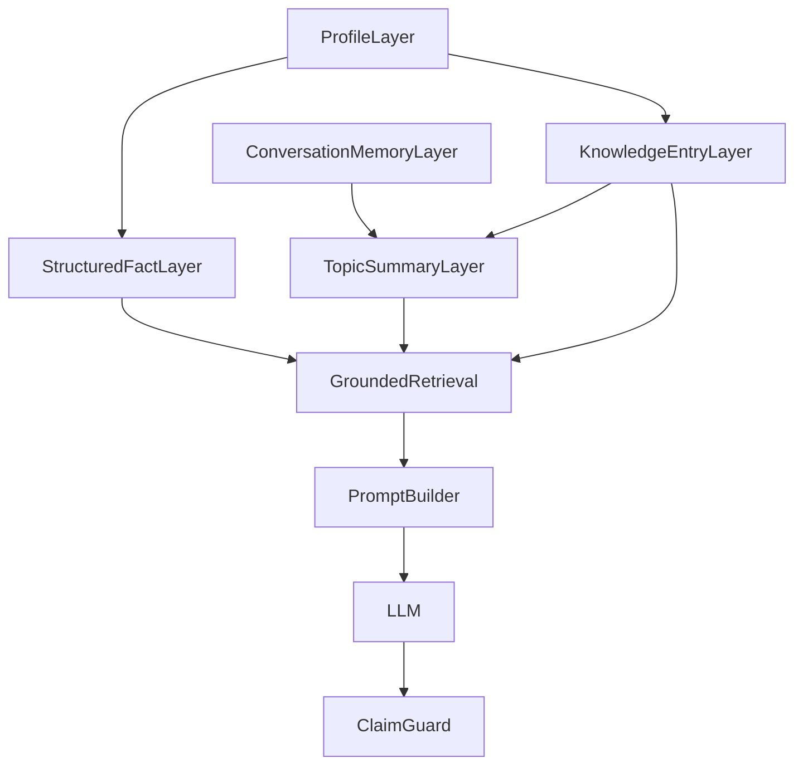

# Life Agent Topic 层后端实现文档

本文档描述 `topic` 层在 Life Agent 系统中的后端落地方案，重点回答：

- `topic summary` 在数据层如何建模
- 需要新增哪些表与字段
- 训练资产如何生成 `topics`
- 聊天时如何做 topic 检索、组装、引用与回写
- 这层如何和已有的 `profile / structuredFacts / knowledgeEntries / memory` 协同

## 1. 目标与边界

`topic` 层不是用来替代：

- `structuredFacts`
- `knowledgeEntries`
- `conversation memory`

而是位于它们之间，承担“把分散经验整理成可复用问题单元”的职责。

一句话定义：

**facts 回答“你是谁”，knowledge 保存原始经验素材，topics 回答“你经历过哪类问题、适合怎么复用这些经验来回答用户”。**

topic 层的主要目标：

- 把长训练对话拆成多个高相关、可召回的经验单元
- 避免回答时把整库 `knowledgeEntries` 全塞给 LLM
- 给检索增加“问题场景级别”的中间层
- 让回答更像真人经验复用，而不是原始条目拼接

非目标：

- 不在这一层保存硬事实真值
- 不在这一层直接替代全文向量库
- 不负责用户长期跨会话记忆审核

## 2. 系统定位

推荐的后端分层如下：



这里的优先级建议保持为：

1. `structuredFacts`
2. `topicSummaries`
3. `knowledgeEntries`
4. `session/cross-session memory`

## 3. 表设计

### 3.1 主表：`life_agent_topic_summaries`

推荐新增主表：

```sql
CREATE TABLE life_agent_topic_summaries (
  id VARCHAR(36) PRIMARY KEY,
  profile_id VARCHAR(36) NOT NULL,
  topic_group VARCHAR(64) NOT NULL,
  topic_key VARCHAR(128) NOT NULL,
  topic_label VARCHAR(255) NOT NULL,
  summary TEXT NOT NULL,
  aliases JSON,
  question_patterns JSON,
  source_entry_ids JSON,
  source VARCHAR(16) NOT NULL DEFAULT 'knowledge',
  confidence VARCHAR(16) NOT NULL DEFAULT 'medium',
  status VARCHAR(16) NOT NULL DEFAULT 'active',
  manual_edited BOOLEAN NOT NULL DEFAULT FALSE,
  merged_into_topic_id VARCHAR(36) NULL,
  created_at DATETIME NOT NULL,
  updated_at DATETIME NOT NULL,
  INDEX idx_lats_profile_id (profile_id),
  INDEX idx_lats_topic_group (topic_group),
  INDEX idx_lats_topic_key (topic_key)
);
```

字段职责：

- `profile_id`
  - 归属哪个 Agent
- `topic_group`
  - 一级分类，如 `career`、`education`
- `topic_key`
  - 二级 topic 的稳定机器标识，如 `career_transition_productManager`
- `topic_label`
  - 给管理台和引用展示的人类可读名称
- `summary`
  - 该 topic 的高密度经验摘要，是运行期最重要的召回文本
- `aliases`
  - 同义问法、口语表达、近义主题
- `question_patterns`
  - 用户可能提出的典型问题模板
- `source_entry_ids`
  - 这个 topic 由哪些 `knowledgeEntries` 聚合而来
- `source`
  - topic 的主要来源，当前实现中主要是 `knowledge` 或 `memory`
- `confidence`
  - 当前 topic 总结的可靠度，建议 `low / medium / high`
- `status`
  - 当前已落地 `candidate / active / archived`
- `manual_edited`
  - 是否被人工修改过；刷新时用于保留人工文案
- `merged_into_topic_id`
  - 若该 topic 已被归并，则指向目标 topic

### 3.2 为什么先不拆第二张关系表

第一版不强制拆 `topic_memory_links` 或 `topic_source_links` 关系表，原因是：

- 当前系统还没有复杂到必须支持 topic 的多跳血缘追踪
- 先把 `source_entry_ids` 放在 JSON 中即可满足最小可用
- 检索时主要关心 `summary + aliases + questionPatterns`

等 topic 层成熟后，再考虑拆出：

- `life_agent_topic_source_links`
- `life_agent_topic_feedback_links`
- `life_agent_topic_memory_links`

## 4. Go 数据结构设计

建议对应的后端模型为：

```go
type LifeAgentTopicSummary struct {
    ID               string
    ProfileID        string
    TopicGroup       string
    TopicKey         string
    TopicLabel       string
    Summary          string
    Aliases          JSONArray
    QuestionPatterns JSONArray
    SourceEntryIDs   JSONArray
    Source           string
    Confidence       string
    Status           string
    ManualEdited     bool
    MergedIntoTopicID *string
    CreatedAt        time.Time
    UpdatedAt        time.Time
}
```

运行期建议再定义一层 AI 使用结构：

```go
type TopicSummaryForAI struct {
    ID               string
    TopicGroup       string
    TopicKey         string
    TopicLabel       string
    Summary          string
    Aliases          []string
    QuestionPatterns []string
    SourceEntryIDs   []string
    Confidence       string
    Status           string
}
```

这样可以和现有结构保持一致：

- `ProfileForAI`
- `StructuredFactForAI`
- `KnowledgeEntryForAI`

## 5. Topic 生成链路

### 5.1 输入来源

topic 的原始来源建议只取两类：

- `LifeAgentKnowledgeEntry`
- 长对话提炼后的 `ConversationMemory`

第一阶段优先从 `knowledgeEntries` 生成，因为它们：

- 已经是半结构化经验素材
- 与创建流程耦合较低
- 不会把未经审核的会话摘要直接升格为 topic

### 5.2 生成阶段

推荐新增一个统一构建函数：

```go
BuildTopicSummariesFromProfileModel(
    profile models.LifeAgentProfile,
    entries []models.LifeAgentKnowledgeEntry,
) []models.LifeAgentTopicSummary
```

其内部职责：

1. 读取全部 `knowledgeEntries`
2. 为每条 entry 估计 `topic_group`
3. 根据标题、标签、内容合成 `topic_key`
4. 将相近条目聚合
5. 生成每个 topic 的 `summary / aliases / questionPatterns`
6. 落库前去重

当前仓库已经拆成两条生成链：

#### 稳定 topic 生成

```go
BuildTopicSummariesFromProfileModel(
    profile models.LifeAgentProfile,
    entries []models.LifeAgentKnowledgeEntry,
) []models.LifeAgentTopicSummary
```

来源：

- `knowledgeEntries`

默认结果：

- `source = knowledge`
- `status = active`

#### 长会话候选 topic 生成

```go
BuildTopicCandidatesFromConversationMemory(
    profileID string,
    sessionID string,
    memory ConversationMemory,
) []models.LifeAgentTopicSummary
```

来源：

- `ConversationMemory.ConversationTopics`
- `ConversationMemory.SummaryText`
- `ConversationMemory.AssistantSuggestions`

默认结果：

- `source = memory`
- `status = candidate`
- `confidence = low`

### 5.3 最小可用生成规则

第一版不必依赖 LLM，也可以先走规则化生成：

- `topic_group`：由 `category + tags + content` 规则匹配
- `topic_key`：由 `topic_group + title/content` 归一化生成
- `summary`：优先取条目内容，必要时截断或压缩
- `aliases`：来自 `title / tags / 常见别名`
- `question_patterns`：由 group 模板自动生成

例如：

- 条目标题：`转产品经理的经历`
- category：`职业选择`
- tags：`转行`、`产品经理`

可生成：

- `topicGroup = career`
- `topicKey = career_transition_productManager`
- `topicLabel = 转产品经理`

### 5.4 推荐的 group 路由规则

建议固定一级类：

- `education`
- `career`
- `industry`
- `cityChoice`
- `startup`
- `money`
- `relationship`
- `family`
- `mental`
- `lifeChoice`
- `social`
- `other`

路由输入可综合：

- `entry.Category`
- `entry.Tags`
- `entry.Title`
- `entry.Content`

推荐规则：

- 先匹配 tags
- 再匹配 category
- 最后匹配 title/content 关键词

### 5.5 当前已落地的状态机

当前已经落地：

- `candidate`
- `active`
- `archived`

状态含义：

- `candidate`
  - 主要用于从长会话 memory 自动长出的候选 topic
- `active`
  - 参与正式检索和回答的 topic
- `archived`
  - 已废弃、重复或已归并的 topic

### 5.6 当前已落地的人工审核能力

当前管理接口已经支持人工：

- 修改 `topicLabel`
- 修改 `summary`
- 修改 `aliases`
- 修改 `questionPatterns`
- 调整 `confidence`
- 调整 `status`

被人工改过的 topic 会写入：

- `manual_edited = true`

## 6. 刷新策略

建议新增统一刷新函数：

```go
refreshLifeAgentTopicSummaries(profileID string)
```

触发时机：

- `LifeAgentsCreate`
- `LifeAgentsUpdate`
- `LifeAgentsModifyViaChat`

当前实现已经不是“删除旧 topic 再整表重建”的简单模式，而是带保留策略的刷新：

1. 读取 profile
2. 读取 knowledge entries
3. 重新生成 `knowledge -> active topics`
4. 若命中已有同 key topic：
   - 未人工编辑：更新 label/summary/aliases/questionPatterns
   - 已人工编辑：保留人工内容，只合并来源和辅助字段
5. 若旧 `knowledge` topic 已不再被生成，则归档为 `archived`

这样做的原因是：

- 避免刷新时把人工维护过的 topic 覆盖掉
- 避免把候选 topic、归档 topic 一起删除
- 让 topic 层真正变成可运营资产，而不是一次性缓存

### 6.1 会话 memory 的 candidate upsert

当前还增加了：

```go
upsertTopicCandidatesFromConversationMemory(profileID, sessionID, memory)
```

它会在会话摘要异步生成后触发：

1. 根据 `ConversationTopics` 生成 candidate topic
2. 和现有 `candidate / active` topic 做相似度匹配
3. 相似则并入已有 topic
4. 否则创建新的 `candidate`

因此当前系统已经具备“从长会话 memory 自动长出新 topic”的最小闭环。

## 7. 聊天检索链路改造

### 7.1 当前链路

当前运行期核心检索基本是：

- 事实检索：`selectFacts`
- 知识条目检索：`selectEntriesWithScores`
- 置信度汇总：`BuildRetrievalPlan`

### 7.2 改造后的 RetrievalPlan

建议扩展为：

```go
type RetrievalPlan struct {
    Facts      []StructuredFactForAI
    Topics     []TopicSummaryForAI
    Entries    []KnowledgeEntryForAI
    Confidence string
    Reasons    []string
}
```

检索顺序建议：

1. `selectFacts(query, facts)`
2. `selectTopics(query, topics)`
3. `selectEntriesWithScores(query, entries)`

这里的关键变化是：

- `topics` 成为主要经验召回层
- `entries` 退到 topic 的补充素材层

### 7.3 Topic 检索打分

推荐新增：

```go
func selectTopics(query string, topics []TopicSummaryForAI) ([]TopicSummaryForAI, int)
func scoreTopic(query string, topic TopicSummaryForAI) int
```

打分建议综合：

- 命中 `topicLabel`
- 命中 `topicKey`
- 命中 `aliases`
- 命中 `questionPatterns`
- 命中 `summary`
- `status == active`
- `confidence == high`

一个简单可行的权重例子：

- label 命中：`+7`
- alias 命中：`+6`
- pattern 命中：`+6`
- summary token 命中：`+2`
- active：`+1`
- high confidence：`+1`

### 7.4 RetrievalPlan 的语义变化

加入 topics 后，`Reasons` 建议支持：

- `fact:school`
- `topic:career_transition_productManager`
- `knowledge:转产品经理的经历`

这有两个好处：

- 便于 debug
- 便于把 feedback 反向归因到 topic

## 8. Prompt 组装方式

### 8.1 System Prompt 增加 Topic Block

当前 prompt 已有：

- `结构化事实`
- `知识库`

建议改成：

- `结构化事实`
- `RelevantTopics`
- `RelevantKnowledge`

推荐注入结构：

```text
【结构化事实】
...

【相关 Topic 摘要】
[1] 转产品经理（career_transition_productManager）
...

【补充知识素材】
[1] 转产品经理的经历（职业选择）
...
```

### 8.2 为什么 topic 要放在 knowledge 前面

因为：

- topic 是已经压缩过的问题场景
- knowledge 是较原始的素材文本
- LLM 更容易先根据 topic 把回答结构立住，再用 knowledge 补细节

## 9. 引用与可解释性

当前引用类型已有：

- `fact`
- `knowledge`

建议新增：

- `topic`

返回结构建议为：

```json
{
  "id": "topic_id",
  "sourceType": "topic",
  "topicGroup": "career",
  "topicKey": "career_transition_productManager",
  "title": "转产品经理",
  "excerpt": "......",
  "confidence": "high"
}
```

这样前端可以把 topic 和 knowledge 区分展示：

- topic 代表“经验主题”
- knowledge 代表“原始来源”

并且 topic 引用已经直接用于：

- topic 级反馈统计
- topic 管理页里的问题定位

## 10. Handler 接入点

### 10.1 创建与编辑

这些接口应在返回中补上 `topicSummaries`：

- `LifeAgentsCreate`
- `LifeAgentsGet`
- `LifeAgentsUpdate`
- `LifeAgentsModifyViaChat`
- `LifeAgentsManage`

建议响应字段统一为：

```json
"topicSummaries": [...]
```

### 10.2 聊天

聊天链路应新增：

1. 读取 `life_agent_topic_summaries`
2. 转换为 `[]TopicSummaryForAI`
3. 传入 `BuildReplyWithLLM` / `BuildReplyWithLLMStream`
4. 在 `BuildRetrievalPlan` 中参与检索
5. 在返回 `references` 中输出 `topic` 类型

当前站内聊天和开放 API 调用都已经接入 topic：

- `LifeAgentsChat`
- `LifeAgentsChatAPI`

### 10.3 API 调用

`LifeAgentsChatAPI` 应和普通聊天保持一致，否则会出现：

- 站内咨询能用 topic
- 开放 API 调用却用不到 topic

这会导致两条链路行为不一致。

## 11. 与 Memory 的关系

推荐边界：

- `memory` 记录“这个用户和我聊过什么”
- `topic summaries` 记录“这个 Agent 本身有哪些可复用经验主题”

所以：

- `ConversationMemory.ConversationTopics` 是会话级临时 topic 信号
- `LifeAgentTopicSummary` 是 Agent 级稳定 topic 资产

当前已经有异步流程把 `ConversationTopics` 升级为候选 topic，但不会直接变成 `active`，仍然经过：

- 相似度并入
- 或人工审核

所以现在的边界是：

- memory 可以长出 `candidate`
- 但不会跳过治理层直接成为稳定真值资产

## 12. Topic 审核、归并与反馈闭环

### 12.1 Topic 管理接口

当前已经落地：

- `GET /api/life-agents/:id/topics`
- `PATCH /api/life-agents/:id/topics/:topicId`
- `POST /api/life-agents/:id/topics/merge`

用途分别是：

- 读取所有 topic 及 topic 级反馈统计
- 修改单个 topic 的文案、状态、置信度
- 把一个 topic 归并到另一个 topic

### 12.2 Topic 归并

当前归并逻辑会：

1. 把 source topic 的 `aliases` 合并到 target
2. 合并 `questionPatterns`
3. 合并 `sourceEntryIDs`
4. 合并 `summary`
5. 提升 target 的 `confidence`
6. 把 source 标记为 `archived`
7. 把 `source.MergedIntoTopicID = target.ID`

这意味着后续反馈统计和管理页展示都能继续沿着归并关系找到主 topic。

### 12.3 Topic 级反馈回流

当前系统没有新增单独的 `topic_feedbacks` 表，而是复用了已有的：

- `life_agent_feedbacks.source_refs`

做法是：

1. 回答时如果命中了 topic，则在 `references` 中输出 `sourceType=topic`
2. 用户提交反馈时，整条回答的 `source_refs` 会被保存进 `life_agent_feedbacks`
3. 管理 topic 时，再从 `source_refs` 中反向聚合每个 topic 的：
   - `helpful`
   - `notSpecific`
   - `notSuitable`
   - `factualError`
   - `contradiction`
   - `tooConfident`

这是一种“零新增反馈表”的轻量实现，但已经足够支撑第一版 topic 治理。

### 12.4 Topic 管理页

当前前端已经新增独立页面：

- `/dashboard/life-agents/[id]/topics`

支持：

- 查看全部 topic
- 按 `candidate / active / archived` 筛选
- 查看 topic 级反馈数
- 手动编辑文案和状态
- 选择目标 topic 并执行归并

## 13. 当前已实现与后续增强

当前已经实现：

1. `LifeAgentTopicSummary` 模型和 `AutoMigrate`
2. `knowledgeEntries -> active topics`
3. `ConversationMemory -> candidate topics`
4. `refreshLifeAgentTopicSummaries(profileID)` 的保留式刷新
5. `BuildRetrievalPlan` 接入 topics
6. Prompt 注入 `相关 Topic 摘要`
7. `references` 支持 `sourceType=topic`
8. topic 审核接口
9. topic 归并接口
10. topic 管理页
11. topic 级反馈聚合

后续增强更值得做的是：

- 更细粒度的 memory chunking
- 更稳的 topic 相似度与归并规则
- 基于反馈自动调整 confidence / rank
- 在管理台展示 topic 来源条目、命中次数和合并历史

## 14. 推荐实现步骤

如果继续往下增强，建议按以下顺序补：

1. 优化 candidate topic 的相似度判断
2. 让 topic 反馈参与 topic 排序
3. 在 topic 管理台增加来源条目预览
4. 引入 embedding / rerank 提升检索稳定性
5. 再考虑更复杂的 topic 血缘表和历史版本

## 15. 最终结论

topic 层的本质不是“再加一份 summary”，而是把经验资产从“原始素材”升级成“可检索的问题主题层”。

在当前仓库架构下，最合适的落地方式是：

- 新增 `life_agent_topic_summaries` 表
- 由 `knowledgeEntries` 聚合生成 `active topics`
- 由 `ConversationMemory` 长出 `candidate topics`
- 在 `BuildRetrievalPlan` 中把 topics 作为主经验召回层
- 在 prompt 中优先注入 `facts + relevant topics`
- 在引用中新增 `sourceType=topic`
- 通过 topic 管理页完成审核、归并和人工修正

这样整个后端会形成更稳定的运行时结构：

**profile + structuredFacts + knowledgeEntries + topicSummaries + conversationMemory + feedback**

这会比当前只靠 facts 和 raw knowledge 的模式更适合处理：

- 长训练对话
- 多主题经历
- 高相关经验复用
- 更像真人的 grounded 回答
